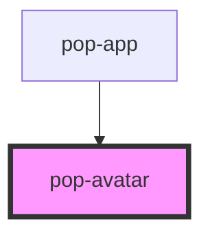

# pop-avatar

<!-- Auto Generated Below -->

## Overview

Avatars are used to show a thumbnail representation of an individual or business in the interface.

## Properties

| Property      | Attribute     | Description | Type      | Default |
| ------------- | ------------- | ----------- | --------- | ------- |
| `placeholder` | `placeholder` |             | `boolean` | `false` |

## Slots

| Slot | Description              |
| ---- | ------------------------ |
|      | Where goes img of avatar |

## CSS Custom Properties

| Name                       | Description                                 |
| -------------------------- | ------------------------------------------- |
| `--placeholder-background` | Color of the background in placeholder mode |
| `--placeholder-color`      | Color of the text in placeholder mode       |

## Dependencies

### Used by

 - [pop-app](../app)

### Graph

----------------------------------------------

*Built with [StencilJS](https://stenciljs.com/)*
