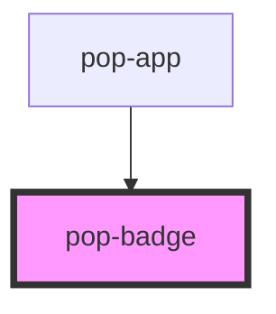

# pop-badge

<!-- Auto Generated Below -->

## Overview

Badges are used to inform the user of the status of specific data.

## Properties

| Property   | Attribute  | Description                                                                                                                                                                                                                                           | Type                                                                                               | Default     |
| ---------- | ---------- | ----------------------------------------------------------------------------------------------------------------------------------------------------------------------------------------------------------------------------------------------------- | -------------------------------------------------------------------------------------------------- | ----------- |
| `as`       | `as`       | Used HTML element for accessibility                                                                                                                                                                                                                   | `"div" \| "span"`                                                                                  | `'div'`     |
| `color`    | `color`    | The color to use from your application's color palette. Default options are: `"neutral"`, `"primary"`, `"secondary"`, `"accent"`, `"info"`, `"success"`, `"warning"`, `"error"`. For more information on colors, see [theming](/docs/theming/basics). | `"accent" \| "error" \| "info" \| "neutral" \| "primary" \| "secondary" \| "success" \| "warning"` | `undefined` |
| `outlined` | `outlined` | Transparent Badge with colored border                                                                                                                                                                                                                 | `boolean`                                                                                          | `false`     |
| `size`     | `size`     | Change size of the component Options are: `"xs"`, `"sm"`, `"md"`, `"lg"`.                                                                                                                                                                             | `"lg" \| "md" \| "sm" \| "xs"`                                                                     | `undefined` |

## Slots

| Slot | Description                       |
| ---- | --------------------------------- |
|      | Slot for the content of the badge |

## Shadow Parts

| Part       | Description                                                 |
| ---------- | ----------------------------------------------------------- |
| `"native"` | The native HTML div or span element that wraps the content. |

## CSS Custom Properties

| Name                   | Description             |
| ---------------------- | ----------------------- |
| `--background`         | Color of the background |
| `--background-opacity` | Background opacity      |
| `--border-color`       | Border color            |
| `--border-opacity`     | Border opcatity         |
| `--border-radius`      | Border radius           |
| `--color`              | Color of the text       |
| `--text-opacity`       | Text opacity            |

## Dependencies

### Used by

 - [pop-app](../app)

### Graph

----------------------------------------------

*Built with [StencilJS](https://stenciljs.com/)*
