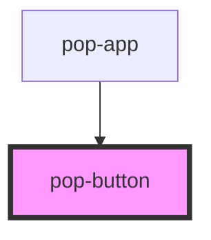

# pop-button

<!-- Auto Generated Below -->

## Overview

Buttons allow the user to take actions or make choices.

## Properties

| Property   | Attribute  | Description                                                                                                                                                                                                                                                      | Type                                                                                                          | Default     |
| ---------- | ---------- | ---------------------------------------------------------------------------------------------------------------------------------------------------------------------------------------------------------------------------------------------------------------- | ------------------------------------------------------------------------------------------------------------- | ----------- |
| `color`    | `color`    | The color to use from your application's color palette. Default options are: `"neutral"`, `"ghost"`, `"primary"`, `"secondary"`, `"accent"`, `"info"`, `"success"`, `"warning"`, `"error"`. For more information on colors, see [theming](/docs/theming/basics). | `"accent" \| "error" \| "ghost" \| "info" \| "neutral" \| "primary" \| "secondary" \| "success" \| "warning"` | `undefined` |
| `disabled` | `disabled` | If `true`, the user cannot interact with the element.                                                                                                                                                                                                            | `boolean`                                                                                                     | `false`     |
| `expand`   | `expand`   | `wide` Add more horizontal padding `block` make a full width button                                                                                                                                                                                              | `"block" \| "wide"`                                                                                           | `undefined` |
| `form`     | `form`     | The HTML form element id. Used to submit a form when the button is not a child of the form.                                                                                                                                                                      | `string`                                                                                                      | `undefined` |
| `outlined` | `outlined` | Transparent Button with colored border                                                                                                                                                                                                                           | `boolean`                                                                                                     | `false`     |
| `shape`    | `shape`    | `square` set button width and heigth with 1:1 ratio `round` set button width and heigth with 1:1 ratio and rounded corners.                                                                                                                                      | `"circle" \| "square"`                                                                                        | `undefined` |
| `size`     | `size`     | Change size of the component Options are: `"xs"`, `"sm"`, `"md"`, `"lg"`.                                                                                                                                                                                        | `"lg" \| "md" \| "sm" \| "xs"`                                                                                | `undefined` |
| `type`     | `type`     | The type of the button.                                                                                                                                                                                                                                          | `"button" \| "reset" \| "submit"`                                                                             | `'button'`  |

## Events

| Event      | Description                          | Type                |
| ---------- | ------------------------------------ | ------------------- |
| `popBlur`  | Emitted when the button loses focus. | `CustomEvent<void>` |
| `popFocus` | Emitted when the button has focus.   | `CustomEvent<void>` |

## Slots

| Slot           | Description                           |
| -------------- | ------------------------------------- |
|                | Slot for the content of the button    |
| `"end-icon"`   | Slot for placing an icon at the end   |
| `"start-icon"` | Slot for placing an icon at the start |

## Shadow Parts

| Part       | Description                                                             |
| ---------- | ----------------------------------------------------------------------- |
| `"native"` | The native HTML button or anchor element that wraps all child elements. |

## CSS Custom Properties

| Name                   | Description                                    |
| ---------------------- | ---------------------------------------------- |
| `--animation-duration` | Duration of press animation                    |
| `--background`         | Color of the background                        |
| `--background-opacity` | Background opacity                             |
| `--border-radius`      | Border radius                                  |
| `--color`              | Color of the text                              |
| `--focus-scale`        | Scale transformation when the button is active |
| `--text-opacity`       | Text opacity                                   |

## Dependencies

### Used by

 - [pop-app](../app)

### Graph

----------------------------------------------

*Built with [StencilJS](https://stenciljs.com/)*
