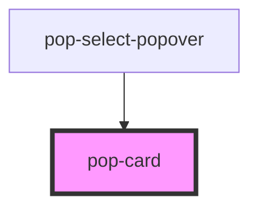

# pop-card

<!-- Auto Generated Below -->

## Properties

| Property | Attribute | Description | Type                           | Default     |
| -------- | --------- | ----------- | ------------------------------ | ----------- |
| `shadow` | `shadow`  |             | `"lg" \| "md" \| "sm" \| "xs"` | `undefined` |

## Dependencies

### Used by

 - [pop-select-popover](../select-popover)

### Graph

----------------------------------------------

*Built with [StencilJS](https://stenciljs.com/)*
