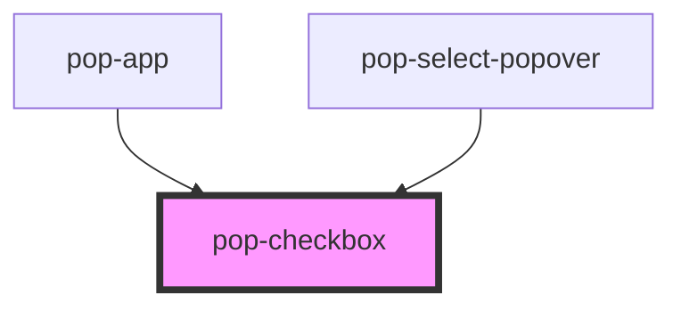

# pop-checkbox

<!-- Auto Generated Below -->

## Overview

Toggles are switches that change the state of a single option.
They can be switched on or off by pressing.
Toggles can also be `"checked"` programmatically by setting the checked property.

## Properties

| Property        | Attribute       | Description                                                                                                                                                                                                                                           | Type                                                                                  | Default         |
| --------------- | --------------- | ----------------------------------------------------------------------------------------------------------------------------------------------------------------------------------------------------------------------------------------------------- | ------------------------------------------------------------------------------------- | --------------- |
| `checked`       | `checked`       | If `true`, the toggle is selected.                                                                                                                                                                                                                    | `boolean`                                                                             | `false`         |
| `color`         | `color`         | The color to use from your application's color palette. Default options are: `"primary"`, `"secondary"`, `"accent"`, `"info"`, `"success"`, `"warning"`, `"error"`. For more information on colors, see [theming](/docs/theming/basics).              | `"accent" \| "error" \| "info" \| "primary" \| "secondary" \| "success" \| "warning"` | `undefined`     |
| `disabled`      | `disabled`      | If true, the user cannot interact with the native element.                                                                                                                                                                                            | `boolean`                                                                             | `false`         |
| `indeterminate` | `indeterminate` | If a developer want to use `indeterminate`, `checked` property should be set to `false`                                                                                                                                                               | `boolean`                                                                             | `false`         |
| `name`          | `name`          | The name of the control, which is submitted with the form data.                                                                                                                                                                                       | `string`                                                                              | `this.#inputId` |
| `placement`     | `placement`     | Where to place the label relative to the checkbox. - `"start"`: The label will appear to the left of the checkbox in LTR and to the right in RTL. - `"end"`: The label will appear to the right of the checkbox in LTR and to the left in RTL.        | `"end" \| "start"`                                                                    | `'start'`       |
| `readonly`      | `readonly`      | If `true`, the user cannot modify the value.                                                                                                                                                                                                          | `boolean`                                                                             | `false`         |
| `required`      | `required`      | If `true`, the user must fill in a value before submitting a form.                                                                                                                                                                                    | `boolean`                                                                             | `false`         |
| `size`          | `size`          | Change size of the component Options are: `"xs"`, `"sm"`, `"md"`, `"lg"`.                                                                                                                                                                             | `"lg" \| "md" \| "sm" \| "xs"`                                                        | `undefined`     |
| `value`         | `value`         | The value of the toggle does not mean if it's checked or not, use the `checked` property for that.  The value of a toggle is analogous to the value of a `<input type="checkbox">`, it's only used when the toggle participates in a native `<form>`. | `string`                                                                              | `'on'`          |

## Events

| Event       | Description                                          | Type                                             |
| ----------- | ---------------------------------------------------- | ------------------------------------------------ |
| `popBlur`   | Emitted when the input loses focus.                  | `CustomEvent<void>`                              |
| `popChange` | Emitted when the user switches the toggle on or off. | `CustomEvent<CheckboxChangeEventDetail<string>>` |
| `popFocus`  | Emitted when the input has focus.                    | `CustomEvent<void>`                              |

## Methods

### `setFocus() => Promise<void>`

Sets focus on the native `input` in `pop-checkbox`. Use this method instead of the global
`input.focus()`.

#### Returns

Type: `Promise<void>`

## Slots

| Slot | Description                                                                                                                              |
| ---- | ---------------------------------------------------------------------------------------------------------------------------------------- |
|      | The label text to associate with the toggle. Use the `"placement"` property to control where the label is placed relative to the toggle. |

## Shadow Parts

| Part       | Description                           |
| ---------- | ------------------------------------- |
| `"label"`  | The label text describing the toggle. |
| `"native"` | The native HTML input element.        |

## CSS Custom Properties

| Name                   | Description                |
| ---------------------- | -------------------------- |
| `--animation-duration` | Animation duration         |
| `--background`         | Background color           |
| `--border-opacity`     | Border opacity             |
| `--border-radius`      | Border radius              |
| `--check-mark-color`   | Change mark color          |
| `--opacity`            | Change background opacity  |
| `--required-color`     | Change required star color |

## Dependencies

### Used by

 - [pop-app](../app)
 - [pop-select-popover](../select-popover)

### Graph

----------------------------------------------

*Built with [StencilJS](https://stenciljs.com/)*
