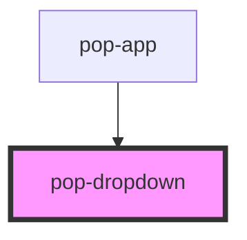

# pop-dropdown

<!-- Auto Generated Below -->

## Overview

Describe whats does the component

## Properties

| Property        | Attribute        | Description                                                                                                                                                                                                                                                                                                                                                                                                                                                                                                                  | Type                                     | Default     |
| --------------- | ---------------- | ---------------------------------------------------------------------------------------------------------------------------------------------------------------------------------------------------------------------------------------------------------------------------------------------------------------------------------------------------------------------------------------------------------------------------------------------------------------------------------------------------------------------------- | ---------------------------------------- | ----------- |
| `align`         | `align`          |                                                                                                                                                                                                                                                                                                                                                                                                                                                                                                                              | `"center" \| "end" \| "start"`           | `undefined` |
| `debounce`      | `debounce`       | Set the amount of time, in milliseconds after the user no longer hover the trigger or dropdown, will dismiss. Only apply on `triggerAction=hover`                                                                                                                                                                                                                                                                                                                                                                            | `number`                                 | `100`       |
| `open`          | `open`           |                                                                                                                                                                                                                                                                                                                                                                                                                                                                                                                              | `boolean`                                | `false`     |
| `showBackdrop`  | `show-backdrop`  | If `true`, a backdrop will be displayed behind the modal. This property controls whether or not the backdrop darkens the screen when the modal is presented.                                                                                                                                                                                                                                                                                                                                                                 | `boolean`                                | `false`     |
| `side`          | `side`           |                                                                                                                                                                                                                                                                                                                                                                                                                                                                                                                              | `"bottom" \| "left" \| "right" \| "top"` | `undefined` |
| `triggerAction` | `trigger-action` | Describes what kind of interaction with the trigger that should cause the popover to open. Does not apply when the `trigger` property is `undefined`. If `"click"`, the popover will be presented when the trigger is left clicked. If `"hover"`, the popover will be presented when a pointer hovers over the trigger. If `"context-menu"`, the popover will be presented when the trigger is right clicked on desktop and long pressed on mobile. This will also prevent your device's normal context menu from appearing. | `"click" \| "context-menu" \| "hover"`   | `'click'`   |

## Events

| Event        | Description                            | Type                |
| ------------ | -------------------------------------- | ------------------- |
| `didDismiss` | Emitted after the modal has dismissed. | `CustomEvent<void>` |
| `didPresent` | Emitted after the modal has presented. | `CustomEvent<void>` |

## Methods

### `dismiss() => Promise<boolean>`

#### Returns

Type: `Promise<boolean>`

### `present() => Promise<boolean>`

#### Returns

Type: `Promise<boolean>`

## Slots

| Slot | Description              |
| ---- | ------------------------ |
|      | // Describe slot content |

## Shadow Parts

| Part         | Description          |
| ------------ | -------------------- |
| `"backdrop"` |                      |
| `"content"`  |                      |
| `"dropdown"` |                      |
| `"trigger"`  |                      |
| `"{name}"`   | // Describe css part |

## Dependencies

### Used by

 - [pop-app](../app)

### Graph

----------------------------------------------

*Built with [StencilJS](https://stenciljs.com/)*
