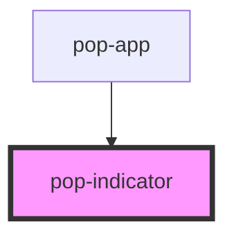

# pop-indicator

<!-- Auto Generated Below -->

## Overview

Indicators are used to place an element on the corner of another element.

## Properties

| Property   | Attribute  | Description                       | Type                                                | Default     |
| ---------- | ---------- | --------------------------------- | --------------------------------------------------- | ----------- |
| `position` | `position` | Align vertically the indicator.   | `"bottom" \| "middle" \| "top"`                     | `undefined` |
| `side`     | `side`     | Align horizontally the indicator. | `"center" \| "end" \| "left" \| "right" \| "start"` | `undefined` |

## Slots

| Slot          | Description                               |
| ------------- | ----------------------------------------- |
|               | Element that should receive the indicator |
| `"indicator"` | Content of the indicator                  |

## CSS Custom Properties

| Name            | Description                     |
| --------------- | ------------------------------- |
| `--translate-x` | Translate the content in X axis |
| `--translate-y` | Translate the content in Y axis |

## Dependencies

### Used by

 - [pop-app](../app)

### Graph

----------------------------------------------

*Built with [StencilJS](https://stenciljs.com/)*
