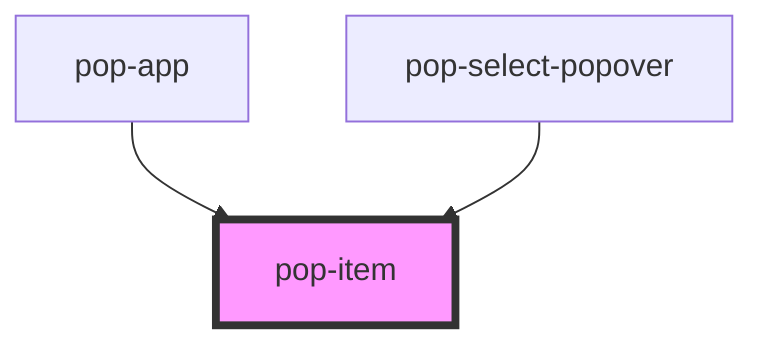

# pop-item

<!-- Auto Generated Below -->

## Properties

| Property   | Attribute  | Description                                        | Type      | Default |
| ---------- | ---------- | -------------------------------------------------- | --------- | ------- |
| `disabled` | `disabled` | If `true`, the user cannot interact with the item. | `boolean` | `false` |

## Dependencies

### Used by

 - [pop-app](../app)
 - [pop-select-popover](../select-popover)

### Graph

----------------------------------------------

*Built with [StencilJS](https://stenciljs.com/)*
