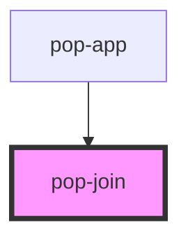

# pop-join

<!-- Auto Generated Below -->

## Overview

Join is a container for grouping multiple items, it can be used to group buttons, inputs, or any other element.
Join applies border radius to the first and last item. Join can be used to create a horizontal or vertical list of items.

## Properties

| Property      | Attribute     | Description                            | Type                         | Default     |
| ------------- | ------------- | -------------------------------------- | ---------------------------- | ----------- |
| `orientation` | `orientation` | Define content disposition orientation | `"horizontal" \| "vertical"` | `undefined` |

## Slots

| Slot | Description                            |
| ---- | -------------------------------------- |
|      | Slot for the content of the join group |

## Dependencies

### Used by

 - [pop-app](../app)

### Graph

----------------------------------------------

*Built with [StencilJS](https://stenciljs.com/)*
