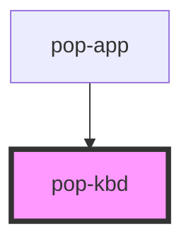

# pop-kbd

<!-- Auto Generated Below -->

## Overview

Kbd is used to display keyboard shortcuts.

## Properties

| Property | Attribute | Description                                                               | Type                           | Default     |
| -------- | --------- | ------------------------------------------------------------------------- | ------------------------------ | ----------- |
| `size`   | `size`    | Change size of the component Options are: `"xs"`, `"sm"`, `"md"`, `"lg"`. | `"lg" \| "md" \| "sm" \| "xs"` | `undefined` |

## Slots

| Slot | Description                     |
| ---- | ------------------------------- |
|      | Slot for the content of the kbd |

## Shadow Parts

| Part       | Description                  |
| ---------- | ---------------------------- |
| `"native"` | The native HTML kbd element. |

## CSS Custom Properties

| Name              | Description                  |
| ----------------- | ---------------------------- |
| `--background`    | Background color             |
| `--border-color`  | Border color & outline color |
| `--border-radius` | Border radius                |
| `--font`          | Change text font             |

## Dependencies

### Used by

 - [pop-app](../app)

### Graph

----------------------------------------------

*Built with [StencilJS](https://stenciljs.com/)*
