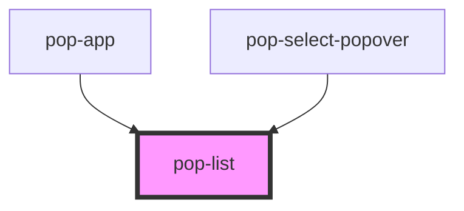

# pop-list

<!-- Auto Generated Below -->

## Properties

| Property      | Attribute     | Description                                                               | Type                           | Default     |
| ------------- | ------------- | ------------------------------------------------------------------------- | ------------------------------ | ----------- |
| `orientation` | `orientation` | Define content disposition orientation                                    | `"horizontal" \| "vertical"`   | `undefined` |
| `size`        | `size`        | Change size of the component Options are: `"xs"`, `"sm"`, `"md"`, `"lg"`. | `"lg" \| "md" \| "sm" \| "xs"` | `undefined` |

## Dependencies

### Used by

 - [pop-app](../app)
 - [pop-select-popover](../select-popover)

### Graph

----------------------------------------------

*Built with [StencilJS](https://stenciljs.com/)*
