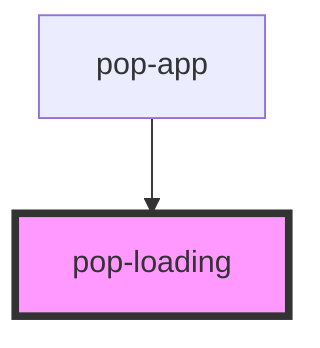

# pop-loading

<!-- Auto Generated Below -->

## Overview

Loading shows an animation to indicate that something is loading.

## Properties

| Property | Attribute | Description                                                               | Type                                                              | Default     |
| -------- | --------- | ------------------------------------------------------------------------- | ----------------------------------------------------------------- | ----------- |
| `size`   | `size`    | Change size of the component Options are: `"xs"`, `"sm"`, `"md"`, `"lg"`. | `"lg" \| "md" \| "sm" \| "xs"`                                    | `undefined` |
| `type`   | `type`    | Apply different animation                                                 | `"ball" \| "bars" \| "dots" \| "infinity" \| "ring" \| "spinner"` | `undefined` |

## CSS Custom Properties

| Name           | Description      |
| -------------- | ---------------- |
| `--background` | Background color |

## Dependencies

### Used by

 - [pop-app](../app)

### Graph

----------------------------------------------

*Built with [StencilJS](https://stenciljs.com/)*
