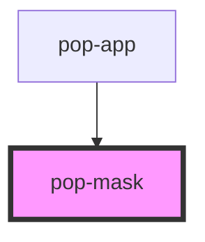

# pop-mask

<!-- Auto Generated Below -->

## Overview

Mask crops the content of the element to common shapes.

## Properties

| Property | Attribute | Description                 | Type                                                                                                                                                                                                                                                                                      | Default     |
| -------- | --------- | --------------------------- | ----------------------------------------------------------------------------------------------------------------------------------------------------------------------------------------------------------------------------------------------------------------------------------------- | ----------- |
| `type`   | `type`    | Mask that should be applied | `"circle" \| "decagon" \| "diamond" \| "heart" \| "hexagon" \| "hexagon-2" \| "parallelogram" \| "parallelogram-2" \| "parallelogram-3" \| "parallelogram-4" \| "pentagon" \| "square" \| "squircle" \| "star" \| "star-2" \| "triangle" \| "triangle-2" \| "triangle-3" \| "triangle-4"` | `undefined` |

## Slots

| Slot | Description             |
| ---- | ----------------------- |
|      | content that get croped |

## Dependencies

### Used by

 - [pop-app](../app)

### Graph

----------------------------------------------

*Built with [StencilJS](https://stenciljs.com/)*
