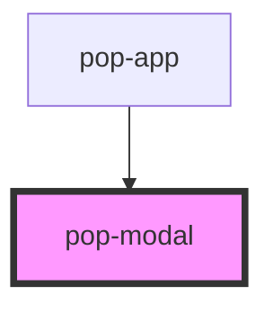

# pop-modal

<!-- Auto Generated Below -->

## Overview

Describe whats does the component

## Properties

| Property          | Attribute          | Description                                                                                                                                                                                                                                                                        | Type                                | Default     |
| ----------------- | ------------------ | ---------------------------------------------------------------------------------------------------------------------------------------------------------------------------------------------------------------------------------------------------------------------------------- | ----------------------------------- | ----------- |
| `backdropDismiss` | `backdrop-dismiss` | If `true`, the modal will be dismissed when the backdrop is clicked.                                                                                                                                                                                                               | `boolean`                           | `false`     |
| `component`       | `component`        | The component to display inside of the popover. You only need to use this if you are not using a JavaScript framework. Otherwise, you can just slot your component inside of `pop-popover`.                                                                                        | `Function \| HTMLElement \| string` | `undefined` |
| `componentProps`  | --                 | The data to pass to the popover component. You only need to use this if you are not using a JavaScript framework. Otherwise, you can just set the props directly on your component.                                                                                                | `{ [key: string]: any; }`           | `undefined` |
| `open`            | `open`             | If `true`, the modal will open. If `false`, the modal will close. Use this if you need finer grained control over presentation, otherwise just use the modalController or the `trigger` property. Note: `open` will automatically be set back to `false` when the modal dismisses. | `boolean`                           | `false`     |
| `showBackdrop`    | `show-backdrop`    | If `true`, a backdrop will be displayed behind the modal. This property controls whether or not the backdrop darkens the screen when the modal is presented.                                                                                                                       | `boolean`                           | `false`     |
| `trigger`         | `trigger`          | An ID corresponding to the trigger element that causes the modal to open when clicked.                                                                                                                                                                                             | `string`                            | `undefined` |

## Events

| Event        | Description                            | Type                |
| ------------ | -------------------------------------- | ------------------- |
| `didDismiss` | Emitted after the modal has dismissed. | `CustomEvent<void>` |
| `didPresent` | Emitted after the modal has presented. | `CustomEvent<void>` |

## Methods

### `dismiss(data: any) => Promise<boolean>`

#### Parameters

| Name   | Type  | Description |
| ------ | ----- | ----------- |
| `data` | `any` |             |

#### Returns

Type: `Promise<boolean>`

### `present() => Promise<boolean>`

#### Returns

Type: `Promise<boolean>`

## Slots

| Slot | Description              |
| ---- | ------------------------ |
|      | // Describe slot content |

## Shadow Parts

| Part       | Description          |
| ---------- | -------------------- |
| `"{name}"` | // Describe css part |

## Dependencies

### Used by

 - [pop-app](../app)

### Graph

----------------------------------------------

*Built with [StencilJS](https://stenciljs.com/)*
