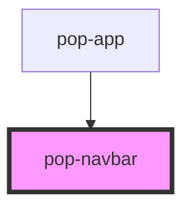

# pop-navbar

<!-- Auto Generated Below -->

## Overview

Navbar is used to show a navigation bar on the top of the page.

## Slots

| Slot      | Description              |
| --------- | ------------------------ |
|           | // Describe slot content |
| `"end"`   | // Describe slot content |
| `"start"` | // Describe slot content |

## Shadow Parts

| Part       | Description                |
| ---------- | -------------------------- |
| `"header"` | Native header html element |

## Dependencies

### Used by

 - [pop-app](../app)

### Graph

----------------------------------------------

*Built with [StencilJS](https://stenciljs.com/)*
