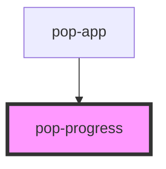

# pop-progress

<!-- Auto Generated Below -->

## Overview

Progress bar can be used to show the progress of a task or to show the passing of time.

## Properties

| Property | Attribute | Description                                                                                                                                                                                                                              | Type                                                                                  | Default     |
| -------- | --------- | ---------------------------------------------------------------------------------------------------------------------------------------------------------------------------------------------------------------------------------------- | ------------------------------------------------------------------------------------- | ----------- |
| `color`  | `color`   | The color to use from your application's color palette. Default options are: `"primary"`, `"secondary"`, `"accent"`, `"info"`, `"success"`, `"warning"`, `"error"`. For more information on colors, see [theming](/docs/theming/basics). | `"accent" \| "error" \| "info" \| "primary" \| "secondary" \| "success" \| "warning"` | `undefined` |
| `max`    | `max`     |                                                                                                                                                                                                                                          | `number`                                                                              | `100`       |
| `value`  | `value`   | The value of a progress is analogous to the value of a `<progress>`                                                                                                                                                                      | `number`                                                                              | `undefined` |

## Shadow Parts

| Part       | Description                     |
| ---------- | ------------------------------- |
| `"native"` | Native `progress` HTML element. |

## CSS Custom Properties

| Name                  | Description                   |
| --------------------- | ----------------------------- |
| `--background`        | Background progress bar       |
| `--background-active` | Background progress bar value |
| `--border-radius`     | Border radius                 |

## Dependencies

### Used by

 - [pop-app](../app)

### Graph

----------------------------------------------

*Built with [StencilJS](https://stenciljs.com/)*
