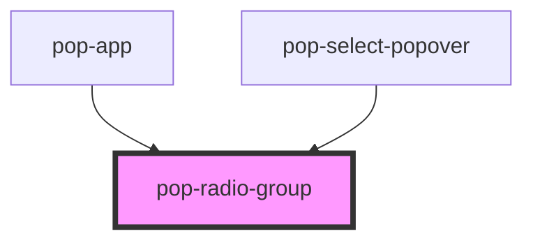

# pop-radio-group

<!-- Auto Generated Below -->

## Properties

| Property     | Attribute     | Description                                                                                                                                                                                                                                                                                   | Type                                                                                  | Default         |
| ------------ | ------------- | --------------------------------------------------------------------------------------------------------------------------------------------------------------------------------------------------------------------------------------------------------------------------------------------- | ------------------------------------------------------------------------------------- | --------------- |
| `allowEmpty` | `allow-empty` | If `true`, the radios can be deselected.                                                                                                                                                                                                                                                      | `boolean`                                                                             | `undefined`     |
| `color`      | `color`       | The color to use from your application's color palette. Default options are: `"primary"`, `"secondary"`, `"accent"`, `"info"`, `"success"`, `"warning"`, `"error"`. For more information on colors, see [theming](/docs/theming/basics).  If the `pop-radio` as no color, it will apply to it | `"accent" \| "error" \| "info" \| "primary" \| "secondary" \| "success" \| "warning"` | `undefined`     |
| `compare`    | `compare`     | This property allows developers to specify a custom function for comparing objects when determining the selected option in the ion-radio-group. When not specified, the default behavior will use strict equality (===) for comparison.                                                       | `((currentValue: any, newValue: any) => boolean) \| string`                           | `undefined`     |
| `disabled`   | `disabled`    | If `true`, apply the disabled property to all `pop-radio`.                                                                                                                                                                                                                                    | `boolean`                                                                             | `false`         |
| `name`       | `name`        | The name of the control, which is submitted with the form data.                                                                                                                                                                                                                               | `string`                                                                              | `this.#inputId` |
| `required`   | `required`    | If `true`, apply the required property to all `pop-radio`.                                                                                                                                                                                                                                    | `boolean`                                                                             | `false`         |
| `size`       | `size`        | Change size of the component Options are: `"xs"`, `"sm"`, `"md"`, `"lg"`.  If the `pop-radio` as no size, it will apply to it                                                                                                                                                                 | `"lg" \| "md" \| "sm" \| "xs"`                                                        | `undefined`     |
| `value`      | `value`       | the value of the radio group.                                                                                                                                                                                                                                                                 | `any`                                                                                 | `undefined`     |

## Events

| Event       | Description                                                                                                                                                  | Type                                            |
| ----------- | ------------------------------------------------------------------------------------------------------------------------------------------------------------ | ----------------------------------------------- |
| `popChange` | The `popChange` event is fired when the user select an option. Unlike the ionInput event, the `popChange` event is fired when the user click on the element. | `CustomEvent<RadioGroupChangeEventDetail<any>>` |

## Slots

| Slot | Description                     |
| ---- | ------------------------------- |
|      | Slot for all of the `pop-radio` |

## Dependencies

### Used by

 - [pop-app](../app)
 - [pop-select-popover](../select-popover)

### Graph

----------------------------------------------

*Built with [StencilJS](https://stenciljs.com/)*
