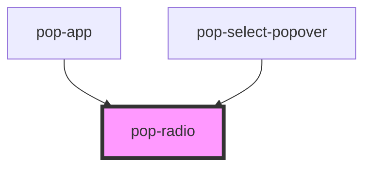

# pop-radio

<!-- Auto Generated Below -->

## Overview

Radio buttons allow the user to select one option from a set.

## Properties

| Property    | Attribute    | Description                                                                                                                                                                                                                                     | Type                                                                                  | Default         |
| ----------- | ------------ | ----------------------------------------------------------------------------------------------------------------------------------------------------------------------------------------------------------------------------------------------- | ------------------------------------------------------------------------------------- | --------------- |
| `autoFocus` | `auto-focus` | If `true`, the element will be focused on page load.                                                                                                                                                                                            | `boolean`                                                                             | `false`         |
| `checked`   | `checked`    | If `true`, the radio is selected.                                                                                                                                                                                                               | `boolean`                                                                             | `false`         |
| `color`     | `color`      | The color to use from your application's color palette. Default options are: `"primary"`, `"secondary"`, `"accent"`, `"info"`, `"success"`, `"warning"`, `"error"`. For more information on colors, see [theming](/docs/theming/basics).        | `"accent" \| "error" \| "info" \| "primary" \| "secondary" \| "success" \| "warning"` | `undefined`     |
| `disabled`  | `disabled`   | If `true`, the user cannot interact with the element.                                                                                                                                                                                           | `boolean`                                                                             | `false`         |
| `name`      | `name`       | The name of the control, which is submitted with the form data.                                                                                                                                                                                 | `string`                                                                              | `this.#inputId` |
| `required`  | `required`   | If `true`, the user must fill in a value before submitting a form.                                                                                                                                                                              | `boolean`                                                                             | `false`         |
| `size`      | `size`       | Change size of the component Options are: `"xs"`, `"sm"`, `"md"`, `"lg"`.                                                                                                                                                                       | `"lg" \| "md" \| "sm" \| "xs"`                                                        | `undefined`     |
| `value`     | `value`      | The value of the radio does not mean if it's checked or not, use the `checked` property for that.  The value of a radio is analogous to the value of a `<input type="radio">`, it's only used when the radio participates in a native `<form>`. | `any`                                                                                 | `''`            |

## Events

| Event      | Description                         | Type                |
| ---------- | ----------------------------------- | ------------------- |
| `popBlur`  | Emitted when the input loses focus. | `CustomEvent<void>` |
| `popFocus` | Emitted when the input has focus.   | `CustomEvent<void>` |

## Methods

### `setFocus() => Promise<void>`

Sets focus on the native `textarea` in `pop-textarea`. Use this method instead of the global
`textarea.focus()`.

#### Returns

Type: `Promise<void>`

## Slots

| Slot | Description                       |
| ---- | --------------------------------- |
|      | Slot for the content of the label |

## Shadow Parts

| Part       | Description                                        |
| ---------- | -------------------------------------------------- |
| `"label"`  | The native HTML label element that wrap the text . |
| `"native"` | The native HTML input element.                     |

## CSS Custom Properties

| Name                   | Description               |
| ---------------------- | ------------------------- |
| `--animation-duration` | Animation duration        |
| `--background`         | Background color          |
| `--border-color`       | Border color              |
| `--border-opacity`     | Border opacity            |
| `--border-radius`      | Border radius             |
| `--opacity`            | Change background opacity |

## Dependencies

### Used by

 - [pop-app](../app)
 - [pop-select-popover](../select-popover)

### Graph

----------------------------------------------

*Built with [StencilJS](https://stenciljs.com/)*
