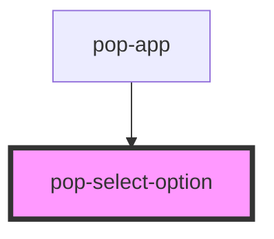

# pop-select-option

<!-- Auto Generated Below -->

## Properties

| Property   | Attribute  | Description                                                                                                                                                                                                                              | Type                                                                                  | Default     |
| ---------- | ---------- | ---------------------------------------------------------------------------------------------------------------------------------------------------------------------------------------------------------------------------------------- | ------------------------------------------------------------------------------------- | ----------- |
| `color`    | `color`    | The color to use from your application's color palette. Default options are: `"primary"`, `"secondary"`, `"accent"`, `"info"`, `"success"`, `"warning"`, `"error"`. For more information on colors, see [theming](/docs/theming/basics). | `"accent" \| "error" \| "info" \| "primary" \| "secondary" \| "success" \| "warning"` | `undefined` |
| `disabled` | `disabled` | If `true`, the user cannot interact with the select option. This property does not apply when `interface="action-sheet"` as `ion-action-sheet` does not allow for disabled buttons.                                                      | `boolean`                                                                             | `undefined` |
| `size`     | `size`     | Change size of the component Options are: `"xs"`, `"sm"`, `"md"`, `"lg"`.                                                                                                                                                                | `"lg" \| "md" \| "sm" \| "xs"`                                                        | `undefined` |
| `value`    | `value`    | The text value of the option.                                                                                                                                                                                                            | `any`                                                                                 | `undefined` |

## Dependencies

### Used by

 - [pop-app](../app)

### Graph

----------------------------------------------

*Built with [StencilJS](https://stenciljs.com/)*
