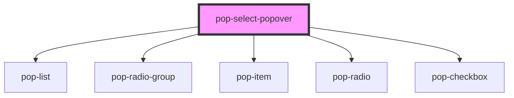

# pop-select-popover

<!-- Auto Generated Below -->

## Properties

| Property   | Attribute  | Description                                                                                                                                                                                                                              | Type                                                                                  | Default     |
| ---------- | ---------- | ---------------------------------------------------------------------------------------------------------------------------------------------------------------------------------------------------------------------------------------- | ------------------------------------------------------------------------------------- | ----------- |
| `color`    | `color`    | The color to use from your application's color palette. Default options are: `"primary"`, `"secondary"`, `"accent"`, `"info"`, `"success"`, `"warning"`, `"error"`. For more information on colors, see [theming](/docs/theming/basics). | `"accent" \| "error" \| "info" \| "primary" \| "secondary" \| "success" \| "warning"` | `undefined` |
| `multiple` | `multiple` | If `true`, the select accepts multiple values                                                                                                                                                                                            | `boolean`                                                                             | `undefined` |
| `options`  | --         | An array of options for the popover                                                                                                                                                                                                      | `SelectPopoverOption[]`                                                               | `[]`        |
| `required` | `required` | If `true`, allow empty on radio options                                                                                                                                                                                                  | `boolean`                                                                             | `undefined` |
| `size`     | `size`     | Change size of the component Options are: `"xs"`, `"sm"`, `"md"`, `"lg"`.                                                                                                                                                                | `"lg" \| "md" \| "sm" \| "xs"`                                                        | `undefined` |

## Dependencies

### Depends on

- [pop-list](../list)
- [pop-radio-group](../radio-group)
- [pop-item](../item)
- [pop-radio](../radio)
- [pop-checkbox](../checkbox)

### Graph

----------------------------------------------

*Built with [StencilJS](https://stenciljs.com/)*
