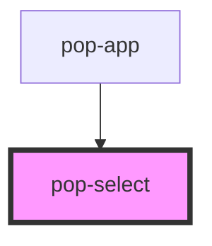

# pop-select

<!-- Auto Generated Below -->

## Properties

| Property             | Attribute               | Description                                                                                                                                                                                                                                         | Type                                                                                             | Default         |
| -------------------- | ----------------------- | --------------------------------------------------------------------------------------------------------------------------------------------------------------------------------------------------------------------------------------------------- | ------------------------------------------------------------------------------------------------ | --------------- |
| `autoFocus`          | `auto-focus`            | If `true`, the element will be focused on page load.                                                                                                                                                                                                | `boolean`                                                                                        | `false`         |
| `bordered`           | `bordered`              | if `true`, adds border to textarea when `color` property is not set.                                                                                                                                                                                | `boolean`                                                                                        | `false`         |
| `color`              | `color`                 | The color to use from your application's color palette. Default options are: `"primary"`, `"secondary"`, `"accent"`, `"ghost"`, `"info"`, `"success"`, `"warning"`, `"error"`. For more information on colors, see [theming](/docs/theming/basics). | `"accent" \| "error" \| "ghost" \| "info" \| "primary" \| "secondary" \| "success" \| "warning"` | `undefined`     |
| `compare`            | `compare`               | This property allows developers to specify a custom function for comparing objects when determining the selected option in the ion-radio-group. When not specified, the default behavior will use strict equality (===) for comparison.             | `((currentValue: any, newValue: any) => boolean) \| string`                                      | `undefined`     |
| `disabled`           | `disabled`              | If `true`, the user cannot interact with the element.                                                                                                                                                                                               | `boolean`                                                                                        | `false`         |
| `helperText`         | `helper-text`           | Text that is placed under the textarea and displayed when no error is detected.                                                                                                                                                                     | `string`                                                                                         | `undefined`     |
| `max`                | `max`                   | Only apply when `multiple` property is used. The maximum amount of values that can be selected, which must not be less than its minimum (min attribute) value.                                                                                      | `number`                                                                                         | `undefined`     |
| `min`                | `min`                   | Only apply when `multiple` property is used. The minimum amount of values that can be selected, which must not be greater than its maximum (max attribute) value.                                                                                   | `number`                                                                                         | `undefined`     |
| `multiple`           | `multiple`              | If `true`, the user can enter more than one value. This attribute applies when the type attribute is set to `"email"`, otherwise it is ignored.                                                                                                     | `boolean`                                                                                        | `undefined`     |
| `name`               | `name`                  | The name of the control, which is submitted with the form data.                                                                                                                                                                                     | `string`                                                                                         | `this.#inputId` |
| `notEnoughErrorText` | `not-enough-error-text` | Only apply when `multiple` property is used. Text that is placed under the select and displayed when the amount of selected option is below of the `min` property.                                                                                  | `string`                                                                                         | `undefined`     |
| `placeholder`        | `placeholder`           | Instructional text that shows before the input has a value.  This property replace the `<option disabled selected>`                                                                                                                                 | `string`                                                                                         | `undefined`     |
| `required`           | `required`              | If `true`, the user must fill in a value before submitting a form.                                                                                                                                                                                  | `boolean`                                                                                        | `false`         |
| `selectedText`       | `selected-text`         | The text to display instead of the selected option's value.                                                                                                                                                                                         | `string`                                                                                         | `undefined`     |
| `size`               | `size`                  | Change size of the component Options are: `"xs"`, `"sm"`, `"md"`, `"lg"`.                                                                                                                                                                           | `"lg" \| "md" \| "sm" \| "xs"`                                                                   | `undefined`     |
| `tooManyErrorText`   | `too-many-error-text`   | Only apply when `multiple` property is used. Text that is placed under the select and displayed when the amount of selected option is greater of the `max` property.                                                                                | `string`                                                                                         | `undefined`     |
| `value`              | `value`                 | The value of a select is analogous to the value of a `<select>`, it's only used when the toggle participates in a native `<form>`.                                                                                                                  | `any`                                                                                            | `undefined`     |

## Events

| Event        | Description                                                                                                                                                                                         | Type                                        |
| ------------ | --------------------------------------------------------------------------------------------------------------------------------------------------------------------------------------------------- | ------------------------------------------- |
| `popBlur`    | Emitted when the input loses focus.                                                                                                                                                                 | `CustomEvent<void>`                         |
| `popChange`  | The `popChange` event is fired when the user modifies the select's value. Unlike the ionInput event, the `popChange` event is fired when the element loses focus after its value has been modified. | `CustomEvent<SelectChangeEventDetail<any>>` |
| `popDismiss` | Emitted when the overlay is dismissed.                                                                                                                                                              | `CustomEvent<void>`                         |
| `popFocus`   | Emitted when the input has focus.                                                                                                                                                                   | `CustomEvent<void>`                         |

## Methods

### `close() => Promise<void>`

#### Returns

Type: `Promise<void>`

### `open(event?: any) => Promise<HTMLPopPopoverElement>`

#### Parameters

| Name    | Type  | Description |
| ------- | ----- | ----------- |
| `event` | `any` |             |

#### Returns

Type: `Promise<HTMLPopPopoverElement>`

### `setFocus() => Promise<void>`

Sets focus on the native `select` in `pop-select`. Use this method instead of the global
`select.focus()`.

#### Returns

Type: `Promise<void>`

## Shadow Parts

| Part      | Description |
| --------- | ----------- |
| `"label"` |             |

## CSS Custom Properties

| Name              | Description                  |
| ----------------- | ---------------------------- |
| `--background`    | Background color             |
| `--border-color`  | Border color & outline color |
| `--border-radius` | Border radius                |
| `--color`         | Change text color            |
| `--error-color`   | Change error text color      |
| `--opacity`       | Change background opacity    |

## Dependencies

### Used by

 - [pop-app](../app)

### Graph

----------------------------------------------

*Built with [StencilJS](https://stenciljs.com/)*
