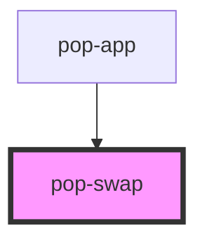

# pop-swap

<!-- Auto Generated Below -->

## Overview

Swap allows you to toggle the visibility of two elements.

## Properties

| Property      | Attribute       | Description                                         | Type                 | Default     |
| ------------- | --------------- | --------------------------------------------------- | -------------------- | ----------- |
| `active`      | `active`        | Activates the swap. Show whats inside the slot `on` | `boolean`            | `undefined` |
| `animation`   | `animation`     | Choose what animation is used on click.             | `"flip" \| "rotate"` | `undefined` |
| `swapOnHover` | `swap-on-hover` | Activates the swap on hover.                        | `boolean`            | `undefined` |

## Slots

| Slot    | Description                                |
| ------- | ------------------------------------------ |
| `"off"` | Slot for element when the swap is inactive |
| `"on"`  | Slot for element when the swap is active   |

## Dependencies

### Used by

 - [pop-app](../app)

### Graph

----------------------------------------------

*Built with [StencilJS](https://stenciljs.com/)*
