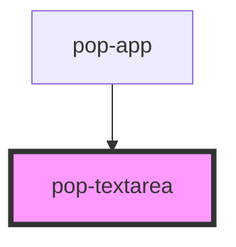

# pop-textarea

<!-- Auto Generated Below -->

## Overview

Textarea allows users to enter text in multiple lines.

## Properties

| Property           | Attribute         | Description                                                                                                                                                                                                                                                                                                                                                                                                                                                                                                                                                                                                                                                                                                           | Type                                                                                             | Default         |
| ------------------ | ----------------- | --------------------------------------------------------------------------------------------------------------------------------------------------------------------------------------------------------------------------------------------------------------------------------------------------------------------------------------------------------------------------------------------------------------------------------------------------------------------------------------------------------------------------------------------------------------------------------------------------------------------------------------------------------------------------------------------------------------------- | ------------------------------------------------------------------------------------------------ | --------------- |
| `autoCapitalize`   | `auto-capitalize` | This features work only on mobile and tablet devices. By default the User Agent and input make their own determination.  - `off` or `none`: No autocapitalization is applied (all letters default to lowercase) - `on` or `sentences`: The first letter of each sentence defaults to a capital letter; all other letters default to lowercase - `words`: The first letter of each word defaults to a capital letter; all other letters default to lowercase - `characters`: All letters should default to uppercase                                                                                                                                                                                                   | `"characters" \| "none" \| "off" \| "on" \| "sentences" \| "words"`                              | `undefined`     |
| `autoFocus`        | `auto-focus`      | If `true`, the element will be focused on page load.                                                                                                                                                                                                                                                                                                                                                                                                                                                                                                                                                                                                                                                                  | `boolean`                                                                                        | `false`         |
| `bordered`         | `bordered`        | if `true`, adds border to textarea when `color` property is not set.                                                                                                                                                                                                                                                                                                                                                                                                                                                                                                                                                                                                                                                  | `boolean`                                                                                        | `false`         |
| `color`            | `color`           | The color to use from your application's color palette. Default options are: `"primary"`, `"secondary"`, `"accent"`, `"ghost"`, `"info"`, `"success"`, `"warning"`, `"error"`. For more information on colors, see [theming](/docs/theming/basics).                                                                                                                                                                                                                                                                                                                                                                                                                                                                   | `"accent" \| "error" \| "ghost" \| "info" \| "primary" \| "secondary" \| "success" \| "warning"` | `undefined`     |
| `cols`             | `cols`            | The visible width of the text control, in average character widths. If it is specified, it must be a positive integer.                                                                                                                                                                                                                                                                                                                                                                                                                                                                                                                                                                                                | `number`                                                                                         | `undefined`     |
| `counter`          | `counter`         | If `true`, a character counter will display the ratio of characters used and the total character limit. Developers must also set the `maxlength` property for the counter to be calculated correctly.                                                                                                                                                                                                                                                                                                                                                                                                                                                                                                                 | `boolean`                                                                                        | `false`         |
| `counterFormatter` | --                | A callback used to format the counter text. By default the counter text is set to "itemLength / maxLength".                                                                                                                                                                                                                                                                                                                                                                                                                                                                                                                                                                                                           | `(inputLength: number, maxLength: number) => string`                                             | `undefined`     |
| `debounce`         | `debounce`        | Set the amount of time, in milliseconds, to wait to trigger the ionInput event after each keystroke.                                                                                                                                                                                                                                                                                                                                                                                                                                                                                                                                                                                                                  | `number`                                                                                         | `0`             |
| `disabled`         | `disabled`        | If `true`, the user cannot interact with the element.                                                                                                                                                                                                                                                                                                                                                                                                                                                                                                                                                                                                                                                                 | `boolean`                                                                                        | `false`         |
| `enterkeyhint`     | `enterkeyhint`    | A hint to the browser for which keyboard to display. That specifies what action label (or icon) to present for the enter key on virtual keyboards.  - `enter`: Typically Inserting a new line. - `done`: Typically meaning there is nothing more to input and the input method editor (IME) will be closed. - `go`: Typically meaning to take the user to the target of the text they typed. - `next`: Typically taking the user to the next field that will accept text. - `previous`: Typically taking the user to the previous field that will accept text. - `search`: Typically taking the user to the results of searching for the text they have typed. - `send`: Typically delivering the text to its target. | `"done" \| "enter" \| "go" \| "next" \| "previous" \| "search" \| "send"`                        | `undefined`     |
| `errorText`        | `error-text`      | Text that is placed under the textarea and displayed when an error is detected.                                                                                                                                                                                                                                                                                                                                                                                                                                                                                                                                                                                                                                       | `string`                                                                                         | `undefined`     |
| `helperText`       | `helper-text`     | Text that is placed under the textarea and displayed when no error is detected.                                                                                                                                                                                                                                                                                                                                                                                                                                                                                                                                                                                                                                       | `string`                                                                                         | `undefined`     |
| `keyboard`         | `keyboard`        | A hint to the browser for which virtual keyboard to display. Possible values: `"none"`, `"text"`, `"tel"`, `"url"`, `"email"`, `"numeric"`, `"decimal"`, and `"search"`.                                                                                                                                                                                                                                                                                                                                                                                                                                                                                                                                              | `"decimal" \| "email" \| "none" \| "numeric" \| "search" \| "tel" \| "text" \| "url"`            | `undefined`     |
| `maxLength`        | `max-length`      | This attribute specifies the maximum number of characters that the user can enter.                                                                                                                                                                                                                                                                                                                                                                                                                                                                                                                                                                                                                                    | `number`                                                                                         | `undefined`     |
| `minLength`        | `min-length`      | This attribute specifies the minimum number of characters that the user can enter.                                                                                                                                                                                                                                                                                                                                                                                                                                                                                                                                                                                                                                    | `number`                                                                                         | `undefined`     |
| `name`             | `name`            | The name of the control, which is submitted with the form data.                                                                                                                                                                                                                                                                                                                                                                                                                                                                                                                                                                                                                                                       | `string`                                                                                         | `this.#inputId` |
| `placeholder`      | `placeholder`     | Instructional text that shows before the input has a value.                                                                                                                                                                                                                                                                                                                                                                                                                                                                                                                                                                                                                                                           | `string`                                                                                         | `undefined`     |
| `readonly`         | `readonly`        | If `true`, the user cannot modify the value.                                                                                                                                                                                                                                                                                                                                                                                                                                                                                                                                                                                                                                                                          | `boolean`                                                                                        | `false`         |
| `required`         | `required`        | If `true`, the user must fill in a value before submitting a form.                                                                                                                                                                                                                                                                                                                                                                                                                                                                                                                                                                                                                                                    | `boolean`                                                                                        | `false`         |
| `rows`             | `rows`            | The number of visible text lines for the control.                                                                                                                                                                                                                                                                                                                                                                                                                                                                                                                                                                                                                                                                     | `number`                                                                                         | `undefined`     |
| `size`             | `size`            | Change size of the component Options are: `"xs"`, `"sm"`, `"md"`, `"lg"`.                                                                                                                                                                                                                                                                                                                                                                                                                                                                                                                                                                                                                                             | `"lg" \| "md" \| "sm" \| "xs"`                                                                   | `undefined`     |
| `spellcheck`       | `spellcheck`      | If `true`, the element will have its spelling and grammar checked. By default the User Agent make their own default behavior.                                                                                                                                                                                                                                                                                                                                                                                                                                                                                                                                                                                         | `boolean`                                                                                        | `false`         |
| `value`            | `value`           | The value of the toggle does not mean if it's checked or not, use the `checked` property for that.  The value of a toggle is analogous to the value of a `<input type="checkbox">`, it's only used when the toggle participates in a native `<form>`.                                                                                                                                                                                                                                                                                                                                                                                                                                                                 | `string`                                                                                         | `''`            |
| `wrap`             | `wrap`            | Indicates how the control wraps text.  - `soft`: Text is not to be wrapped when submitted (though can still be wrapped in the rendering). - `hard`: Text is to have newlines added by the user agent so that the text is wrapped when it is submitted.  If wrap attribute is in the `hard` state, the `cols` property must be specified.                                                                                                                                                                                                                                                                                                                                                                              | `"hard" \| "soft"`                                                                               | `undefined`     |

## Events

| Event       | Description                                                                                                                                                                                                                                                                                                   | Type                                     |
| ----------- | ------------------------------------------------------------------------------------------------------------------------------------------------------------------------------------------------------------------------------------------------------------------------------------------------------------- | ---------------------------------------- |
| `popBlur`   | Emitted when the input loses focus.                                                                                                                                                                                                                                                                           | `CustomEvent<void>`                      |
| `popChange` | The `popChange` event is fired when the user modifies the textarea's value. Unlike the ionInput event, the `popChange` event is fired when the element loses focus after its value has been modified.                                                                                                         | `CustomEvent<TextareaChangeEventDetail>` |
| `popFocus`  | Emitted when the input has focus.                                                                                                                                                                                                                                                                             | `CustomEvent<void>`                      |
| `popInput`  | The `popInput` event is fired each time the user modifies the textarea's value. Unlike the `popChange` event, the `popInput` event is fired for each alteration to the textarea's value. This typically happens for each keystroke as the user types.  This event can be debouced by the `debounce` property. | `CustomEvent<TextareaInputEventDetail>`  |

## Methods

### `setFocus() => Promise<void>`

Sets focus on the native `textarea` in `pop-textarea`. Use this method instead of the global
`textarea.focus()`.

#### Returns

Type: `Promise<void>`

## Slots

| Slot | Description                       |
| ---- | --------------------------------- |
|      | Slot for the content of the label |

## Shadow Parts

| Part       | Description                                        |
| ---------- | -------------------------------------------------- |
| `"label"`  | The native HTML label element that wrap the text . |
| `"native"` | The native HTML input element.                     |

## CSS Custom Properties

| Name               | Description                  |
| ------------------ | ---------------------------- |
| `--background`     | Background color             |
| `--border-color`   | Border color & outline color |
| `--border-radius`  | Border radius                |
| `--color`          | Change text color            |
| `--error-color`    | Change error text color      |
| `--font`           | Change text font             |
| `--opacity`        | Change background opacity    |
| `--required-color` | Change required star color   |

## Dependencies

### Used by

 - [pop-app](../app)

### Graph

----------------------------------------------

*Built with [StencilJS](https://stenciljs.com/)*
