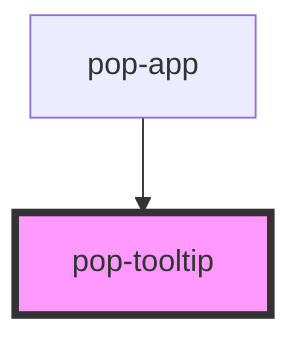

# pop-tooltip

<!-- Auto Generated Below -->

## Overview

Tooltip can be used to show a message when hovering over an element.

## Properties

| Property             | Attribute  | Description                                                                                                                                                                                                                              | Type                                                                                  | Default     |
| -------------------- | ---------- | ---------------------------------------------------------------------------------------------------------------------------------------------------------------------------------------------------------------------------------------- | ------------------------------------------------------------------------------------- | ----------- |
| `color`              | `color`    | The color to use from your application's color palette. Default options are: `"primary"`, `"secondary"`, `"accent"`, `"info"`, `"success"`, `"warning"`, `"error"`. For more information on colors, see [theming](/docs/theming/basics). | `"accent" \| "error" \| "info" \| "primary" \| "secondary" \| "success" \| "warning"` | `undefined` |
| `open`               | `open`     | Force open tooltip                                                                                                                                                                                                                       | `boolean`                                                                             | `false`     |
| `position`           | `position` | Define the position of tooltip By default the tootip appear on top                                                                                                                                                                       | `"bottom" \| "left" \| "right" \| "top"`                                              | `undefined` |
| `value` _(required)_ | `value`    | Text to show on hover                                                                                                                                                                                                                    | `string`                                                                              | `undefined` |

## Slots

| Slot | Description                         |
| ---- | ----------------------------------- |
|      | Slot for the content of the tooltip |

## CSS Custom Properties

| Name                   | Description        |
| ---------------------- | ------------------ |
| `--background`         | Background color   |
| `--background-opacity` | Background opacity |
| `--color`              | Text color         |
| `--tail`               | Tooltip arrow size |
| `--text-opacity`       | Text opacity       |

## Dependencies

### Used by

 - [pop-app](../app)

### Graph

----------------------------------------------

*Built with [StencilJS](https://stenciljs.com/)*
